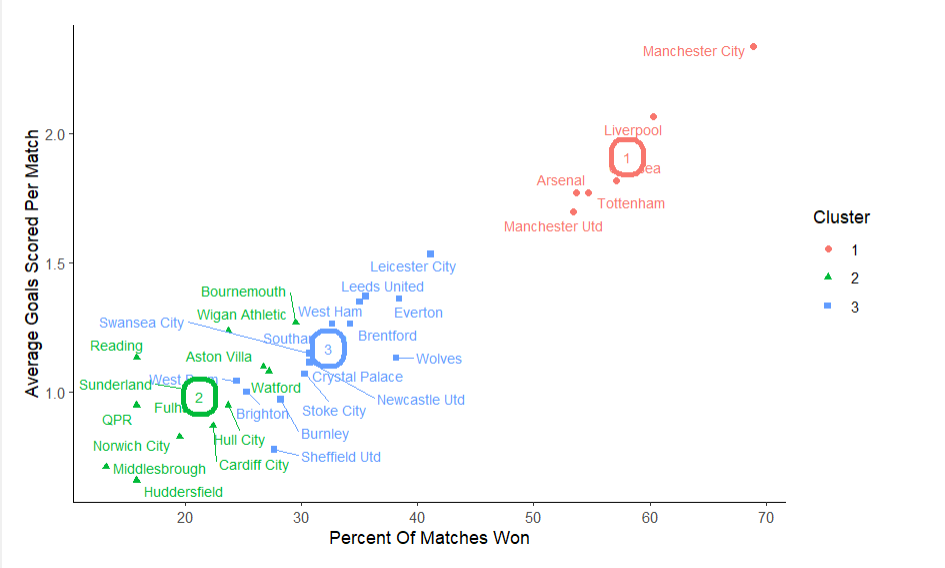
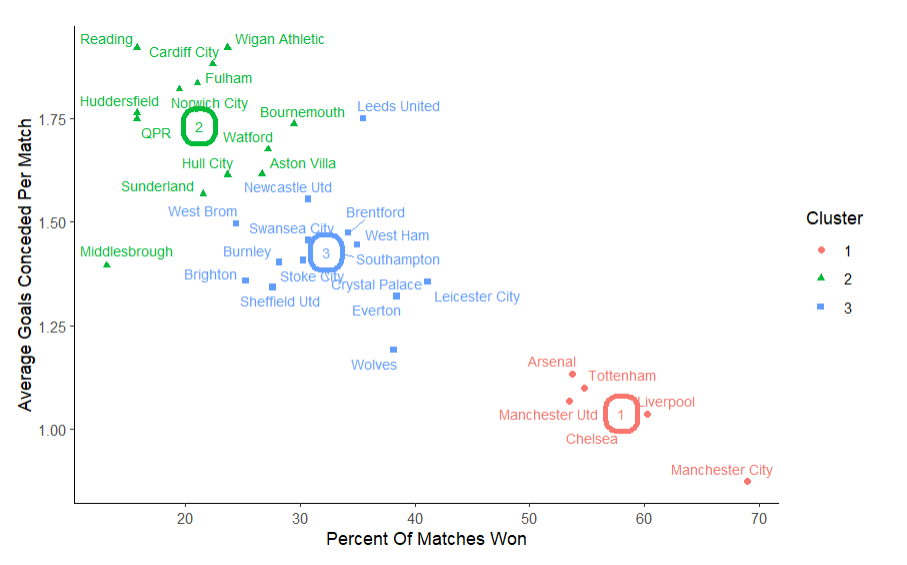
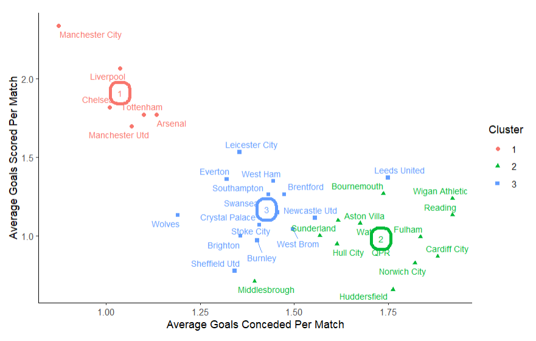
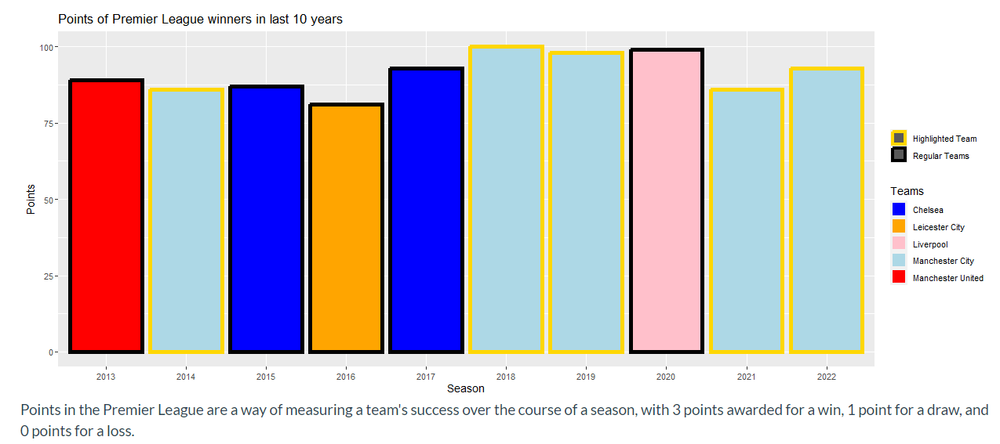

```{r setup, include = FALSE}
# Set code chunk defaults 
# Consider adding `message = FALSE` option
knitr::opts_chunk$set(echo = FALSE) 
                      
# Set R environment options
options(knitr.kable.NA = '')

# Load packages
library(tidyverse)

```

# Introduction

The English Football League system comprises of four leagues at different levels: the Premier League, EFL Championship, EFL League One, and EFL League Two. Teams in lower-level leagues can be promoted to the higher-level league if they finish in the top three or four positions, while teams in a higher-level league can be relegated to the lower-level league if they finish in the bottom three or four positions. For instance, Norwich City was promoted to the Premier League from the EFL Championship in 2021 as they were one of the top-performing teams in that league.

In this blog, our focus will be on the Premier League, which is the highest level of the English Football League system. The top four teams in the Premier League qualify for the UEFA Champions League, the highest level of club football competition in Europe, instead of getting promoted.

Our analysis will identify the highest-performing Premier League teams of the past decade and determine which team is the most dominant. Additionally, we will investigate if any of the high performing teams have been unlucky or lucky with the number of Premier League titles they have won.

## **Methodology**

Our analysis utilized a host of R libraries such as **`RSQLite`**, **`tidyverse`**, **`igraph`**, **`ggraph`**, **`dplyr`**, **`ggnetwork`**, and **`Shiny Apps`** to facilitate data extraction, transformation, analysis, and visualization. More specific methodologies are mentioned throughout.

# Visualization and Analysis

## Clusters {.tabset}

In our first set of visualizations, we have created three cluster plots representing various aspects of team performance: Goals Scored vs Percentage Wins, Goals Conceded vs Percentage Wins, and Goals Scored vs Goals Conceded. This is what is known as a k-means clustering analysis. The purpose of this analysis is to group teams based on their performance metrics.

**Determining the Number of Clusters (k)**: We used the elbow method to determine the optimal number of clusters (k) for the k-means algorithm. The elbow plot is a plot of the total within-cluster sum of squares against the number of clusters. The optimal k is usually chosen at the "elbow" point of the plot, which is where adding more clusters doesn't significantly reduce the total within-cluster sum of squares. In this case, the optimal k is 3.

### Goals Scored v.s Percentage Wins

```{r, fig.cap='"1"', out.width="80%", fig.align="center"}
 
```

### Goals Conceded v.s Percentage Wins

```{r, fig.cap='"2"', out.width="80%", fig.align="center"}

```

### Goals Scored v.s Goals Conceded

```{r, fig.cap='"3"', out.width="80%", fig.align="center"}

```

# **Network Graph Analysis**

A network graph is a visual representation of the relationships between entities; in this case, football teams. Each team is represented as a node in the graph, and the edges (lines connecting the nodes) represent the goal differential between two teams. This provides a clear, intuitive way to understand the relationships and disparities among teams based on their past performance.

**The Shiny app** allows users to interact with the network graph, selecting a specific team to view their goal differential with every other team they played against in the last ten years. This interactive feature allows users to explore data at a granular level, making the analysis more personal and engaging.

For example, when a user selects Manchester United, the app highlight the team's node and its connections with other teams. The edge thickness could vary according to the goal difference, and the color could indicate a positive or negative differential. This way, users can easily perceive how well the selected team performed against others in terms of goal difference. In this case, the network graph shows a pretty dominant Manchester City Team as almost all the arrows are show a postive goal difference.

```{r}
knitr::include_app("https://michaelp.shinyapps.io/networkGraph/",
                   height = "800px")

```

# Presentation of the Interactive Premier League Data Table

In our pursuit of providing an encompassing perspective on English Premier League's last decade, we have curated an interactive table that manifests key statistics for all the teams that participated during this period. This dynamic platform offers the convenience of a broad overview and the specificity of individual team statistics, providing a versatile tool for both casual browsers and dedicated analysts.

The data fueling this interactive feature has been procured from a reputable source, FBref, and specifically, from their comprehensive compilation of the 2021-2022 Premier League season statistics (https://fbref.com/en/comps/9/2021-2022/2021-2022-Premier-League-Stats).

However, raw data, while rich in potential insights, can often be challenging to navigate and interpret. Recognizing this, we've employed robust data wrangling techniques to refine this raw data, focusing on relevant variables and ensuring that they are presented in an easily comprehensible format.


```{r table-app, out.width = "250%", out.extra = 'data-external="1" frameborder="no"', fig.cap = "[Data Science Premier League Table Shiny App](https://michaelp.shinyapps.io/table/)"}
knitr::include_app("https://michaelp.shinyapps.io/table/",
                   height = "800px")
```

# Decade-long Review of Premier League Winners through a Bar Graph

Our exploration concludes with a visual representation in the form of a bar graph, delineating the total points scored by each victorious Premier League team over the past decade. Each win in a season contributes three points to a team's total, providing a straightforward metric to gauge the performance of a team over the season.

A glance at the bar graph unmistakably highlights Manchester City's dominance. Their frequent ascents to the pinnacle of the league, reflected in their substantial points tally, underscore their consistent high-level performance over the past decade.

However, while Manchester City's success is indisputable, the graph reveals an essential truth of competitive sports - no team, no matter how dominant, is invincible. We see evidence of this in the occasional triumphs of other teams from the high-performing cluster, who have managed to break Manchester City's winning streak and claim the league title for themselves.

```{r}
 
```

# Conclusion

Throughout our comprehensive data analysis, the compelling evidence of Manchester City's dominance in English football has been unmistakable. They have consistently displayed superior performance metrics across various key parameters, including win percentage, average goals scored per match, and average goals conceded per match. This dominance is further emphasized in our network graph, where Manchester City frequently exhibits a positive goal differential against numerous competing teams.

However, it's important to note that dominance, while a significant factor, doesn't always equate to winning the league. The volatile nature of football, replete with its unpredictabilities and chance events, means that a team's dominance doesn't provide an infallible prediction of their league-winning potential. This reflects a critical tenet of data science: correlation does not imply causation.

Moreover, winning a league involves a complex interplay of factors beyond just dominant performance in isolated matches. Aspects such as team morale, injuries, managerial strategies, and even the impact of external factors like fan support and weather conditions play crucial roles. Data science, while powerful, can only provide quantifiable insights and cannot account for these qualitative elements that can significantly sway a season's outcomes.

Additionally, we utilized the K-means clustering algorithm to identify clusters within our dataset, revealing groups of teams with similar performance characteristics. Manchester City's position within the cluster of top-performing teams underscores their dominance. However, it also highlights that they are not alone in this high-performance cluster, indicating stiff competition at the apex of the league.

In conclusion, while data science methodologies and tools like R programming, k-means clustering, and Shiny interactive applications provide valuable insights and illuminate patterns such as Manchester City's dominance, they don't deterministically predict outcomes like league victories. In the dynamic, multifaceted world of football, dominance is just one piece of the larger, intricate puzzle that decides the league champion. The beautiful game, much like data science, thrives on the balance of predictability and surprise, order and chaos.

# References

All data sources, any key R packages, and any other sources used in developing your blog should be cited in full in a list of references at the end of your blog. Your blog post should also link to these sources as they are discussed. You may choose any reference style as long as sources are fully cited (try to be consistent!).

Typically, references in R Markdown (and LaTeX) files are [incorporated with a BibTeX database](https://bookdown.org/yihui/rmarkdown-cookbook/bibliography.html) (a .bib file). You can try this approach or manually include either a numbered or alphabetized list.

Columbia University has compiled some guidance on [how to cite data](https://guides.library.columbia.edu/datacitation). Some data sources will give you the citation information to copy and paste. Use the provided citations or citation styles in those cases.

You can list R package citations with the code `citation("packageName")` in the console and then copy (and reformat as needed) the relevant text, e.g.,

```{r}
citation("DT")
```

The following citations are based on the American Statistical Association citation style (not all of these references are used in this document).:

<!-- Textbook -->

Baumer, B. S., Kaplan, D. T., and Horton, N. J. (2021), *Modern Data Science with R* (2nd ed.), Boca Raton, FL: CRC Press.

<!-- Journal article -->

Broman, K. W. and Woo, K. H. (2018), "Data Organization in Spreadsheets," *The American Statistician*, 72:1, 2-10, doi: [10.1080/00031305.2017.1375989](https://doi.org/10.1080/00031305.2017.1375989)

<!-- Website -->

Columbia University Libraries (n.d.), "Data Citation," available at <https://guides.library.columbia.edu/datacitation>.

<!-- Journal article -->

McNamara, A. and Horton N. J. (2018) "Wrangling Categorical Data in R," *The American Statistician*, 72:1, 97-104, doi: [10.1080/00031305.2017.1356375](https://doi.org/10.1080/00031305.2017.1356375).

<!-- Dataset -->

Shah, Syed A. A. (October 2022), "Starbucks Drinks" (Version 1), *Kaggle*, available at <https://www.kaggle.com/datasets/syedasimalishah/starbucks-drinks>.

<!-- R package -->

Xie Y, Cheng J, Tan X (2022). "DT: A Wrapper of the JavaScript Library 'DataTables'," R package version 0.24, available at <https://CRAN.R-project.org/package=DT>.
